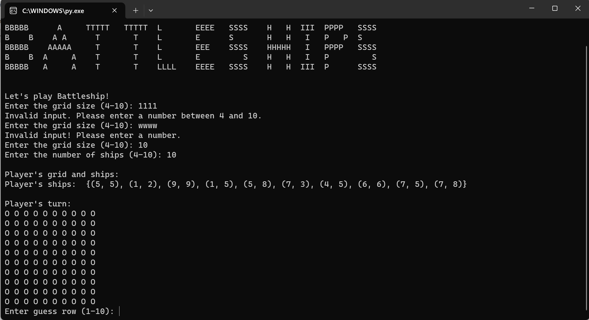
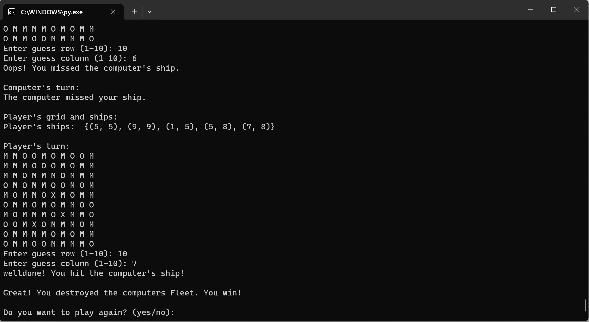

# Battleships PRO

Battleships Pro is a python terminal game, which runs in the mock terminal on Heroku

The live link can be found here [Battleships PRO](https://battleships-pro-c36fcd97acc4.herokuapp.com/)

## How to Play
- Battleship pro is based on the classic pen-and-paper game. You can read more about it on [Wikipedia](https://en.wikipedia.org/wiki/Battleship_(game))
- this version is a single player game. player will play against Computer
- On start player can set the grid size and number of ships
- player can see his grid, Computer's grind is hidden
- player have to make a guess where the opponent's ships are located on grid. if player guess right location of grid thats a hit, that means one of compter ships is destroyed
- player's goal is to destroy computer's Fleet, same is the Goal of computer
- Who destroyes the opponent's fleet first, is winner of the Game

## Features
- User ability to set the size of Board and number of ships
  - The Board of Computer is hidden so player cant see where the Computers Ships are located
   

- Play against the Computer
- Accepts user inputs 
- Invalid inputs are denied
- Maintain user and computer scores

- Input validation and error-checking
- User cannot enter coordinates outside the size of the grid
- User must enter numbers alphabets and all other characters are invalid

- Game result, determins Game winner 
- Options to start a new Game or quit game

### Features in planning
  - player can postion ships themselves
  - player can set the size of ships

## User Stories

- ### First Time User
  - As a first time user I want to understand the Theory of the gamem,
    as the game is based on the classic pen-and-paper game .
  - As a first time user I want to learn Game Rules and be able to play the Game.

- ### Returning user
  - As a returning user I want to increase my playability.
 
- ### Frequent user
  - As a frequent user I want to be able to beat my previous score on the leaderboard.

## Testing 

 The Project is tested manualy by following methods
 - Tested through PEP8 linter there are no errors, only few long line warnings
 - Tested by entering invalid numbers and strings and out of range numbers
 - Tested in local terminal and the Code Institute Heroku terminal

### Bugs
- There were so many indentation errors, removed all errors one by one
- The input validation Function was missing in Code, my Mentor mentioned that after testing. game keep crashing after invalid inputs. added code for input validation function, and limiting the size of board and number of ships, solved the Issue
  

## Deployment

The live link can be found here [Battleships PRO](https://battleships-pro-c36fcd97acc4.herokuapp.com/)
- The Game is  deployed to heroku, it enables users to place the game without having an understanding of back end languages.
- To deploy this project I followed these steps:
 - Add \n to all inputs in run.py file
 - pip freeze requirements (I did not have anything to    add to this file as I did not install any packages)
 - Login to my heroku account
 - Create an app for this project in heruoku
 - Add buildpacks on heroku of python and node.js as these are needed for the project to work when deployed, Python needed to be the first build pack, then node.js.
 Then go to the deploy section, connect heroku to my github account.
 - Deploy Branch

## Credits 
- Code Institute for the deployment terminal
- Wikipedia for the details of the Battleship game

### Content 

- throughout the making, got a lots of guidance from [W3scools](https://www.w3schools.com/) and [youtube](https://www.youtube.com/) Tutorials 

### Acknowledgments

Thanks to my Mentor Antonio Rodriguez who inspired me with his positive and responsible attitude. He helped me throughout the project, pointed out Bugs, and gave me useful tips to finalize the project.

